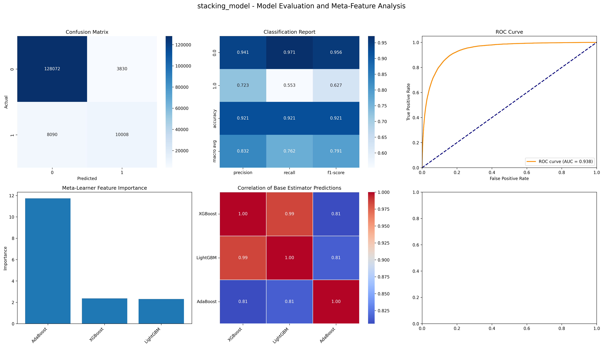
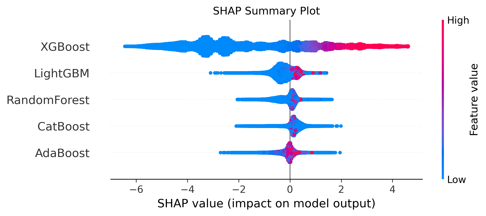
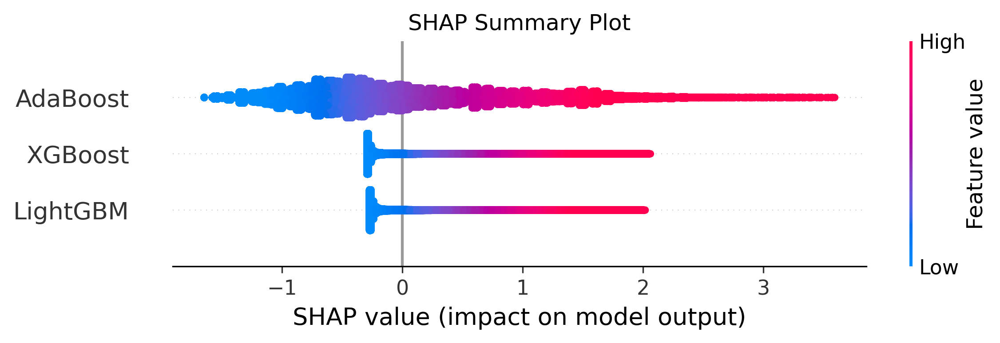

# KAGGLE - Bank Register Prediction

## 📌 Project Overview

This project is based on a Kaggle competition about predicting whether a bank client will subscribe to a term deposit using marketing campaign data.

The dataset comes from a Portuguese banking institution marketing campaign.  
Each record represents a client contacted during a campaign, and the goal is to build a machine learning model to predict whether the client will subscribe to a term deposit (`yes` / `no`).  

Dataset characteristics:

- Mixed categorical & numerical features
- Imbalanced target variable
- Real-world marketing data
- Evaluation based on prediction accuracy / probability

Reference: Bank Marketing Dataset / Kaggle competition / UCI dataset  
The data is related to direct marketing campaigns of a Portuguese bank where the goal is to predict if the client will subscribe a term deposit.  

---

## 📁 Project Structure

KAGGLE-BankRegisterPrediction/
├── data/                   # Dataset (train / test / processed) — ignored in git
├── models/                 # Saved trained models (.pkl / .joblib)
├── output/                 # Prediction results / submission files
├── src/                    # Core python scripts
│   ├── __init__.py
│   ├── data_processing.py  # Cleaning, encoding, feature engineering
│   ├── train_model.py      # Model training logic
│   ├── predict.py          # Generate predictions
│   └── utils.py            # Helper functions / metrics / plots
├── notebook/               # Jupyter notebooks for experiments / EDA
├── main.py                 # Entry point for training / inference
├── requirements.txt        # Python dependencies
└── README.md               # Project documentation

---

## ⚙️ Setup

### 1. Clone repo

```bash
git clone https://github.com/Hiihyhyhuhu/KAGGLE-BankRegisterPrediction
cd KAGGLE-BankRegisterPrediction
```
### 2. Create environment
```bash
python -m venv venv
source venv/bin/activate
```
### 3. Install dependencies
```bash
pip install -r requirements.txt
```

## 🚀 How to Run

1. Load dataset
2. Preprocess data
3. Train model
4. Predict test set
5. Save output file

## 📊 Result

Prediction results are saved in: `output/`

Stacking Evaluation


<table> <tr> <td align="center">

SHAP Summary v2


</td> </tr> <tr> <td align="center">

SHAP Summary v4


</td> </tr> </table>

Metrics | Score
:---:|:---:
accuracy |0.9205
roc_auc|0.9382
f1| 0.9159
precision| 0.9144
recall| 0.9205
log_loss| 0.1968

💡 Future Improvements

- Hyperparameter tuning
- Cross validation
- Ensemble models
- Feature engineering
- Handling imbalance

👤 Author

Tran Chanh Hy
UTS – Web / AI / Data Science Projects

GitHub:
https://github.com/Hiihyhyhuhu
